### MySQL 

- 数据库架构

  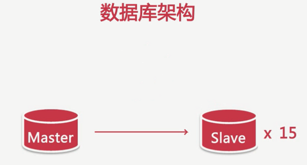

  - 并发量：同一时间处理的请求数量

- 影响数据库的因素：

  - SQL慢查询
  - 服务器硬件
  - 网卡流量
  - 磁盘IO

- 超高的QPS和TPS:

  - QPS:每秒处理的查询量（`Queries Per Second`）

    例如：10ms处理1个SQL

    ​		1s处理100个SQL

    ​	那么QPS<=100

  - TPS:每秒事务处理量（`TransactionsPerSecond`）

- 大量的并发和超高的CPU使用率

  - 风险：

    - 大量的并发：

    ​	数据库连接数被占满

    ​	(max_connections 默认100)

    - 高CPU使用率：

       CPU资源消耗殆尽而出现宕机

- 磁盘IO：

  ​	磁盘IO性能突然下降（使用更快的设备)

  ​	其他大象消耗磁盘性能的计划任务（调整计划任务，做好磁盘维护）

- 网卡：

  - 减少从服务器的数量
  - 进行分级缓存
  - 避免模糊查询
  - 分离业务网络和服务器网络

- 大表：1000W行或者文件超过10G

  - 慢查询：很难在一定的时间内过滤出所需要的数据

  - DDL操作的影响：

    ​	版本小于5.5，简历索引会锁表

    ​	不小于5.5 不锁表 但是会引起主从延迟

    ​	修改表结构需要长时间锁表 造成长时间主从延迟

    ​	影响正常的数据操作

  - 解决方案：分库分表把一张表分成多个表

    - 难点：分表主键的选择

      ​	  分表后跨分区数据的查询和同级

    - 大表的历史数据归档 减少对前后端业务的影响

      - 难点：归档时间点的选择

- 事务：数据库系统区别于其他一切文件的系统的重要特性之一；一组具有原子性的SQL语句，或是一个独立的工作单元

  - 属性：acid

    - 原子性

      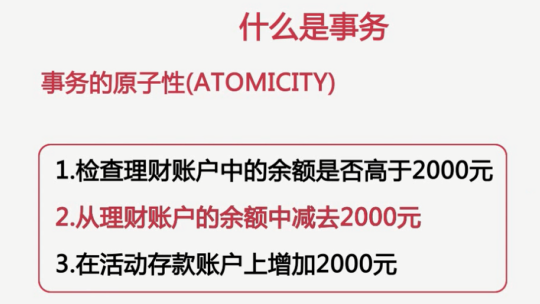

    - 一致性

      

    - 隔离性(set session )

      开启事务：begin; commit;

      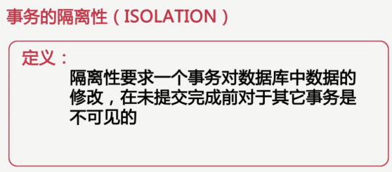

      - 未提交读（脏读）

      - 已提交读

        开启了事务1，只要事务2提交了，事务1里面查询的数据是不一样的

      - 可重复读

        开启了事务1，不论事务2改变数据与否，事务1里面查询到的数据始终是一样的>。注意下面的指令

        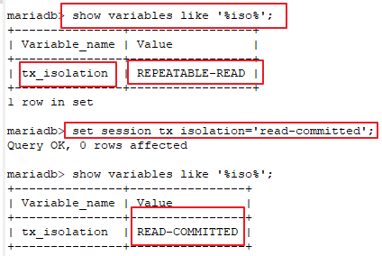

      - 可串行化（很少使用这个）

    - 事务持久性

      - 大事务：运行时间比较长，操作的数据比较多的事务

      - 风险：锁定太多的数据，造成大量的阻塞和锁超时

        ​	回滚时所需时间比较长

        ​	执行时间长，容易造成主从延迟

      - 处理：①避免一次处理太多的数据。②移除不必要在事务里面执行的 SQL语句。

- 影响性能的几个方面：

  - 服务器硬件

    - CPU：
      - CPU型任务？
      - 系统并发量
      - MySQL版本
      - 选择32还是64为CPU

    - 内存：

    - 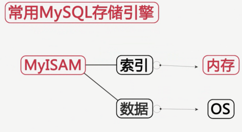

      - 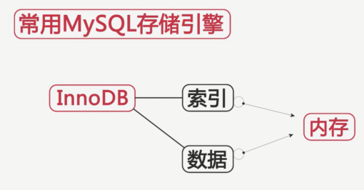
      - 

      - 当内存和磁盘大小一样的时候就没影响

      - 

        ex:商品浏览器达到一定数量时再一次写入。

      - 内存选择：选择主板支持的最大内存频率

    - 磁盘的选择和配置

      - 传统磁盘

        读取过程：移动磁头到磁盘表面上正确的位置；等待磁盘旋转，使所需数据在磁头之下（等待时间）；读取所有的数据（传输速度）；

        - 存储容量
        - 传输速度
        - 访问时间
        - 主轴转速
        - 物理尺寸

      - RAID技术：磁盘冗余队列

        - RAID0： 成本低 不提供冗余或者错误修复能力（串行在一起，）

        - RAID1：冗余 成本高（存放日志）

        - RAID 5：

        - RAID 10：分片的镜像

          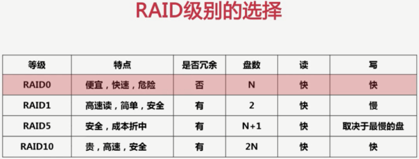

      - SSD和PCIE

        

        

      - SAN和NAS

  - 服务器系统

    - windows

    - FreeBSD

    - Solaris

    - Linux

      --------------------------------------------

    - centos系统参数优化

      - 内核相关参数（`/etc/sysctl.conf`）

        - 监听队列长度 ### 队列里面数据包最大数目 ### 还未获得连接的可保留在队列里面的最大数目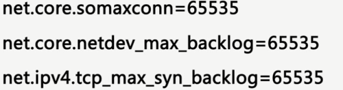
        - 加快TCP链路回收：

        - 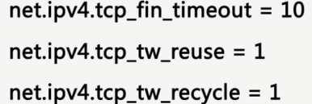

        - 缓冲区大小

          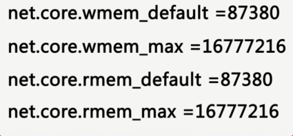

        - 减少TCP连接失效占用的资源

          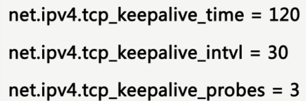

          

        - 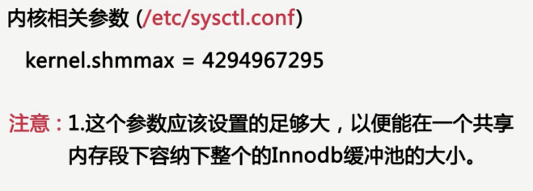

          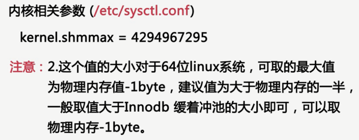

          

          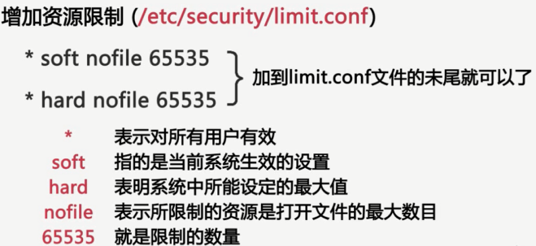

          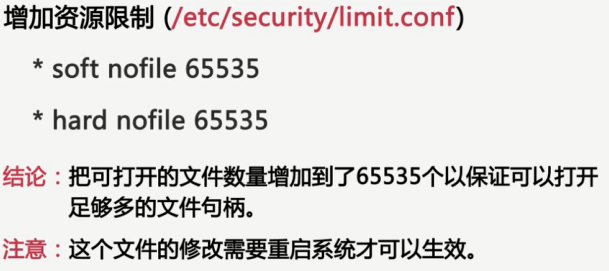

          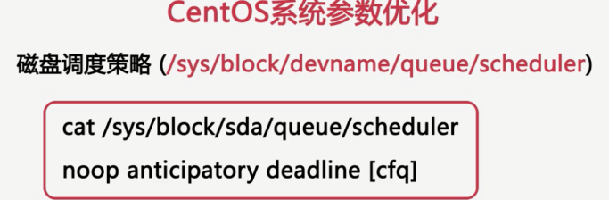

          

     - 文件系统

       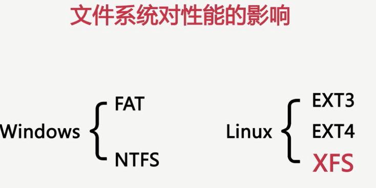

          

  - 数据库存储引擎

    - `MyISAM`:不支持事务、表级锁 
    - `InnoDB`:事务存储引擎，完美支持行级锁，事务acid特性

  - 数据库参数配置

    

  - 数据库结构设计和SQL语句

    - 慢查询

--------------------------------------------------------------------------------------------------------------------------------------

- MySQL体系结构

  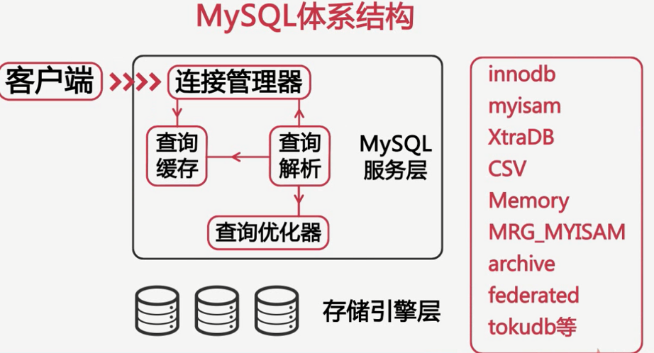

  - note：存储引擎是针对于表的而不是针对于库，一个库里面表可以使用不同的引擎

- MySQL存储引擎

  - `MyISAM`：5.5版本之前默认存储引擎

    - 临时表：在排序、分组等操作中，当数量超过一定的带下之后，由查询优化器建立的临时表

    - 这个存储引擎表有MYD和MYI组成：

      `frm`：结构信息

      `myd`：数据信息

      `myi`：索引信息

    - 特性：

      - 并发性与锁级别：

        表级锁 ==> 读取和写入互斥  因此读写混合的操作，其并发性不好。

        对于只读操作其并发性还是可以的，不会阻塞共享锁。

      - 表损坏修复：

        ` check table tablename`

        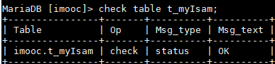

        

        `repair table tablename`

        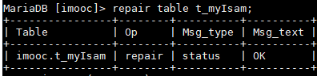

        

      - MyISAM表支持的索引类型：

        ​	全文索引（5.7以前唯一官方支持的）

        ​	前缀索引

      - MyISAM表支持数据压缩

        myisampack

      - 限制 

        默认表大小为4G（5.0以前）

        需要修改MAX_Rows和AVG_ROW_LENGTH

        5.0版本以后支持大小为256T

      - 使用场景

        - 非事务型应用
        - 只读类应用
        - 空间类应用

    - `InnoDB`

      `innodb`使用表空间进行数据存储

      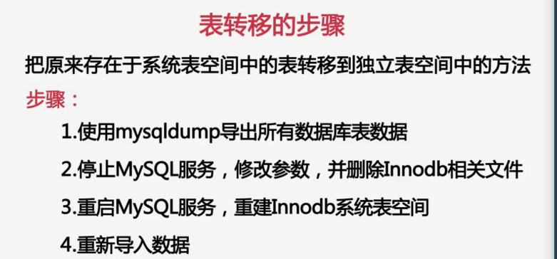

      - InnoDB是一种事务型存储引擎

      - 完全支持事务的acid特性

      - 重做日志（redo log）和回滚日志（undo log）

        这两个日志实现了：原子性/一致性/持久性

        redo ：存储已经提交的事务

        undo：存储未提交的事务

        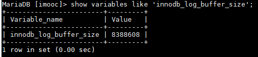

      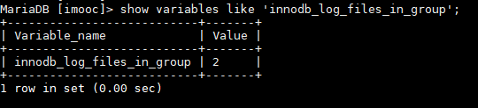

      - `InnoDB`支持行级锁
      - 行级锁可以最大程度的支持并发
      - 行级锁是由存储引擎层实现的

    - 锁：

      - 管理共享资源的并发访问

      - 实现事务的隔离性

      - 类型：

        独占锁（写锁）

        共享锁（读锁）

        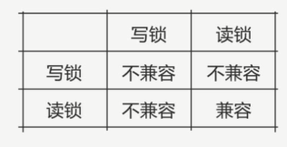

      - 锁的粒度：行级锁/表级锁

      表级锁：开销小 并发低

        - ex：开启表级锁

        - 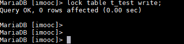

          

          

          解锁：

          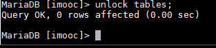

          

        - 行级锁

---------------------------------------------------------------------------------------------------------------------------------------------------------------

2019.8.7笔记

This is a test font color

This is a test font color 

This is a test font color

<h3 style="color:red">MySQL常用存储引擎之InnoDB</h3>

