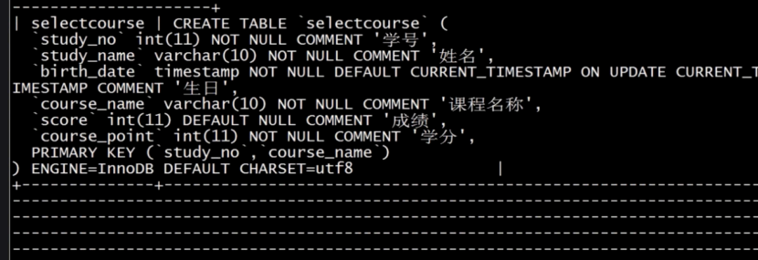
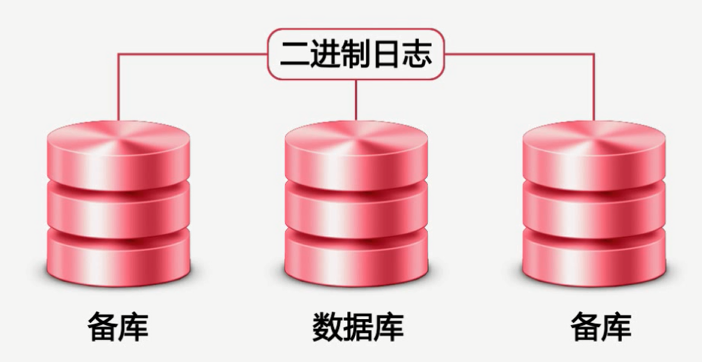

# MySQL性能管理及架构设计

##  第1章  实例和故事

- 数据库架构

  

  - 并发量：同一时间处理的请求数量

- 影响数据库的因素：

  - SQL慢查询
  - 服务器硬件
  - 网卡流量
  - 磁盘IO

- 超高的QPS和TPS:

  - QPS:每秒处理的查询量（`Queries Per Second`）

    例如：10ms处理1个SQL

    ​		1s处理100个SQL

    ​	那么QPS<=100

  - TPS:每秒事务处理量（`TransactionsPerSecond`）

- 大量的并发和超高的CPU使用率

  - 风险：

    - 大量的并发：

    ​	数据库连接数被占满

    ​	(max_connections 默认100)

    - 高CPU使用率：

       CPU资源消耗殆尽而出现宕机

- 磁盘IO：

  ​	磁盘IO性能突然下降（使用更快的设备)

  ​	其他大象消耗磁盘性能的计划任务（调整计划任务，做好磁盘维护）

- 网卡：

  - 减少从服务器的数量
  - 进行分级缓存
  - 避免模糊查询
  - 分离业务网络和服务器网络

- 大表：1000W行或者文件超过10G

  - 慢查询：很难在一定的时间内过滤出所需要的数据

  - DDL操作的影响：

    ​	版本小于5.5，简历索引会锁表

    ​	不小于5.5 不锁表 但是会引起主从延迟

    ​	修改表结构需要长时间锁表 造成长时间主从延迟

    ​	影响正常的数据操作

  - 解决方案：分库分表把一张表分成多个表

    - 难点：分表主键的选择

      ​	  分表后跨分区数据的查询和同级

    - 大表的历史数据归档 减少对前后端业务的影响

      - 难点：归档时间点的选择

- 事务：数据库系统区别于其他一切文件的系统的重要特性之一；一组具有原子性的SQL语句，或是一个独立的工作单元

  - 属性：acid

    - 原子性

      

    - 一致性

      

    - 隔离性(set session )

      开启事务：begin; commit;

      

      - 未提交读（脏读）

      - 已提交读

        <font color="red">开启了事务1，只要事务2提交了，事务1里面查询的数据是不一样的</font>

      - 可重复读

        <font color="yellow">开启了事务1，不论事务2改变数据与否，事务1里面查询到的数据始终是一样的</font>>。注意下面的指令

        

      - 可串行化（很少使用这个）

    - 事务持久性

      - 大事务：运行时间比较长，操作的数据比较多的事务

      - 风险：锁定太多的数据，造成大量的阻塞和锁超时

        ​	回滚时所需时间比较长

        ​	执行时间长，容易造成主从延迟

      - 处理：①避免一次处理太多的数据。②移除不必要在事务里面执行的 SQL语句。

## 第2章 什么影响了MySQL性能

- 影响性能的几个方面：

  - 服务器硬件

    - CPU：
      - CPU型任务？
      - 系统并发量
      - MySQL版本
      - 选择32还是64为CPU

    - 内存：

    - 

      - 
      - 

      - 当内存和磁盘大小一样的时候就没影响

      - 

        ex:商品浏览器达到一定数量时再一次写入。

      - 内存选择：选择主板支持的最大内存频率

    - 磁盘的选择和配置

      - 传统磁盘

        读取过程：移动磁头到磁盘表面上正确的位置；等待磁盘旋转，使所需数据在磁头之下（等待时间）；读取所有的数据（传输速度）；

        - 存储容量
        - 传输速度
        - 访问时间
        - 主轴转速
        - 物理尺寸

      - RAID技术：磁盘冗余队列

        - RAID0： 成本低 不提供冗余或者错误修复能力（串行在一起，）

        - RAID1：冗余 成本高（存放日志）

        - RAID 5：

        - RAID 10：分片的镜像

          

      - SSD和PCIE

        

        

      - SAN和NAS

  - 服务器系统

    - windows

    - FreeBSD

    - Solaris

    - Linux

      --------------------------------------------

    - centos系统参数优化

      - 内核相关参数（`/etc/sysctl.conf`）

        - 监听队列长度 ### 队列里面数据包最大数目 ### 还未获得连接的可保留在队列里面的最大数目
        - 加快TCP链路回收：

        - 

        - 缓冲区大小

          

        - 减少TCP连接失效占用的资源

          

          

        - 

          

          

          

          

          

          

     - 文件系统

       

          

  - 数据库存储引擎

    - `MyISAM`:不支持事务、表级锁 
    - `InnoDB`:事务存储引擎，完美支持行级锁，事务acid特性

  - 数据库参数配置

    

  - <font color="red">数据库结构设计和SQL语句<font>

    - 慢查询

--------------------------------------------------------------------------------------------------------------------------------------

- MySQL体系结构

  

  - note：存储引擎是针对于表的而不是针对于库，一个库里面表可以使用不同的引擎

- MySQL存储引擎

  - `MyISAM`：5.5版本之前默认存储引擎

    - 临时表：在排序、分组等操作中，当数量超过一定的带下之后，由查询优化器建立的临时表

    - 这个存储引擎表有MYD和MYI组成：

      `frm`：结构信息

      `myd`：数据信息

      `myi`：索引信息

    - 特性：

      - 并发性与锁级别：

        表级锁 ==> 读取和写入互斥  因此读写混合的操作，其并发性不好。

        对于只读操作其并发性还是可以的，不会阻塞共享锁。

      - 表损坏修复：

        ` check table tablename`

        

        

        `repair table tablename`

        

        

      - MyISAM表支持的索引类型：

        ​	全文索引（5.7以前唯一官方支持的）

        ​	前缀索引

      - MyISAM表支持数据压缩

        myisampack

      - 限制 

        默认表大小为4G（5.0以前）

        需要修改MAX_Rows和AVG_ROW_LENGTH

        5.0版本以后支持大小为256T

      - 使用场景

        - 非事务型应用
        - 只读类应用
        - 空间类应用

    - `InnoDB`

      `innodb`使用表空间进行数据存储

      

      - InnoDB是一种事务型存储引擎

      - 完全支持事务的acid特性

      - 重做日志（redo log）和回滚日志（undo log）

        这两个日志实现了：原子性/一致性/持久性

        redo ：存储已经提交的事务

        undo：存储未提交的事务

        

      

      - `InnoDB`支持行级锁
      - 行级锁可以最大程度的支持并发
      - 行级锁是由存储引擎层实现的

    - 锁：

      - 管理共享资源的并发访问

      - 实现事务的隔离性

      - 类型：

        独占锁（写锁）

        共享锁（读锁）

        

      - 锁的粒度：行级锁/表级锁

      表级锁：开销小 并发低

        - ex：开启表级锁

        - 

          

          

          解锁：

          

          

        - 行级锁

---------------------------------------------------------------------------------------------------------------------------------------------------------------

2019.8.7笔记

### 阻塞和死锁

- 什么是阻塞

  一个事务里面的锁需要等待另一个事务中的锁事务中的锁释放资源，这就形成了阻塞。

- 什么是死锁

  两个及以上的事务相互占用对方的资源造成死锁

### InnoDB状态检查 

`show engine innodb status`

#### InnoDB使用场景

- `InnoDB`适用于大多数OLTP应用

  

### CSV 存储引擎

- 数据以文本方式存储在文件中

- CSV文件存储表内容

- CSM文件存储表的元数据如表状态量和数据量

- `frm`文件存储表结构信息

  #### 特点：

  - 以CSV格式进行数据存储

  - 所有列必须都是不能为null

  - 不支持索引

    不适合大表，不适合在线处理

  - 可以对数据文件直接编辑

    保存文本文件的内容

  #### 使用场景

  电子表格--->CSV文件--->MySQL数据目录

  数据--->CSV文件---->其他web程序

### archive引擎

#### 	存储特点

​		以`zlib`对数据进行压缩，磁盘IO更少

​		数据存储在ARZ为后缀的文件中

```python
#### 	引擎特点
```

​		只支持insert和select

​		只允许在自增ID列上加索引

	##### 	使用场景

​		日志和数据采集应用

### memory存储引擎

#### 	文件存储特点：数据保存在内存里面

- 功能特点：
  - 支持hash索引(等值查找)和btree索引(范围查找)
  - 所有字段都为固定长度
  - 不支持blog和text等大字段
  - 使用表级锁
  - 最大大小由max_heap_table_size参数决定
- 易混淆的概念

###  2.21 如何选择正确的存储引擎

- 参考条件

  - 事务
  - 备份
  - 崩溃回复
  - 存储引擎的特点

- MySQL获取配置信息路径

  - 命令参数

    `mysqld_safe --datadir=/data/sql_data`

## 第3章 MySQL基准测试

### 3-1 什么是MySQL基准测试

- 基准测试：
  - 定义：针对系统设置的一种压力测试
  - 要求：直接、简单、易于比较，用于评估服务器的处理能力
- 压力测试：对真实的业务数据进行测试，获取真实系统所能趁手的压力

### 3-2 如何进行基准测试

- 测试目的：
  - 建立MySQL服务器的性能基准线
  - 模拟比当前系统更高的负载，找出系统的扩展瓶颈，增加数据库并发，观察QPS/TPS变化，确定并发量与性能最优的关系
  - 测试不同的硬件、软件和操作系统配置
  - 证明新的硬件设备是否配置正确

- 对整个系统进行测试：

  优点：

  - 能够测试整个系统的性能，包括web服务器缓存、数据库等

  - 能反映系统中各个组件接口见的性能问题体现真实状况

  缺点：

  - 测试设计复杂，消耗时间长

- 单独对MySQL进行基准测试

  优点：

  - 测试设计简单，所需消耗时间短

  缺点：

  - 无法全面了解整个系统的性能测试

- MySQL测试常见指标

  - TPS（事务）

  - QPS（查询）

  - 相应时间：
    - 平均响应时间
    - 最小响应时间
    - 最大响应时间
    - 各时间所占百分比

  - 并发量：同时处理的查询请求的数量

### 3-3 基准测试步骤

- 计划和设计基准测试

  - 对整个系统还是某个组件

  - 使用什么样的数据

  - 准备基准测试及数据收集脚本

    CPU使用率、IO、网络流量、状态与计数器信息等

  - 运行基准测试

  - 保存及分析基准测试

- 容易产生的问题：

  - 使用生产环境数据时只使用了部分数据

  - 在多用户场景中，只做单用户的测试

  - 在但服务器上测试分布式应用

  - 反复执行同一查询

 ### 3-4 MySQLslap

## 第4章 数据库结构设计

### 4-1 数据库结构优化的目的

- 减少数据冗余
- 尽量避免数据维护中出现更新，插入和删除异常
  - 插入异常：如果表中某个实体随着另一个实体而存在
  - 更新异常：如果更改表中的某个实体的单独属性时，需要对多行进行更新
  - 删除异常：删除一个实体导致其他实体消失

​    

### 4-2 数据库结构设计

- 第一范式：

  - 所有字段都只具有单一属性
  - 单一属性的列由基本的数据类型所构成（整型/浮点型。。。）
  - 设计出来的表都是二维表

- 第二范式：

  - 一个表中只具有一个主键业务，符合第二范式的表中不能存在非主键列只对部分主键的依赖关系

    

- 第三范式

  - 每个非主键属性既不部分依赖于也不传递依赖于主键业务，也就是在第二范式的基础上消除了非主属性对主键的传递依赖。

## 第五章  高可用架构设计

### 5-1 MySQL复制功能介绍



复制解决问题：

- 实现在不同服务器上的数据分布
- 利用二进制日志增量进行
- 不需要太多的带宽
- 但是在使用基于行的复制在进行大批量的更改时，会对带宽带来一定的压力，特别是跨IDC环境进行复制
- 实现了在不同服务器上的数据分布
- 实现数据读取的负载均衡，需要其他组件配合，利用DNS轮训的方式把程序的读连接到不同的备份数据库使用LVS，haproxy这样的代理方式
- 增强了数据安全
- 实现数据可高可用和故障切换
- 实现数据库在线升级

### 5-2 MySQL二进制日志

- 服务层日志

  - 二进制日志
  - 慢查询日志
  - 通用日志

- 存储引擎层日志：

  - InnoDB
    - redo日志
    - undo日志

- 二进制日志：

  - 记录所有对MySQL数据库的修改事件，包括crud事件和对表结构修改的事件

  - 二进制日志的格式

    - 基于段的格式`binlog_format=STATEMENT`

      优点：

      ​	日志记录量相对较小，节约磁盘及网络IO

      缺点

      ​	可能造成MySQL复制的主备服务器数据不一致

      ​	特定函数如UUID(),user()

      ​	这样非确定性函数还是无法复制

      