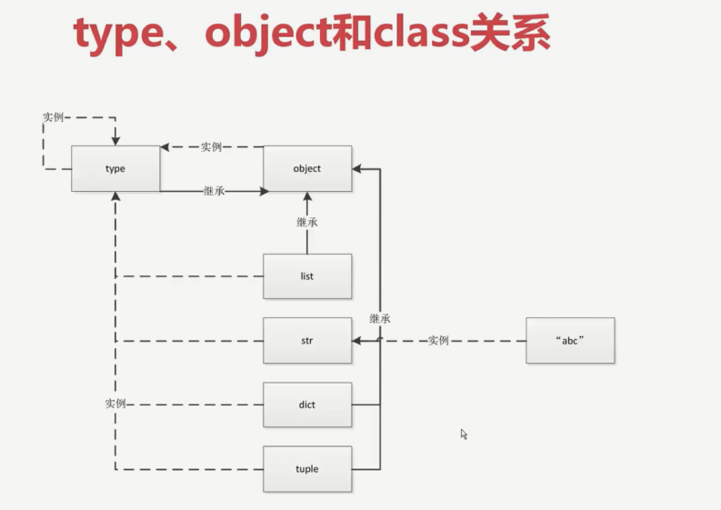
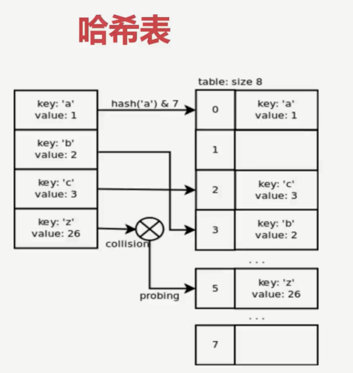
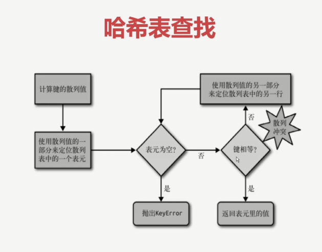

# Python高级编程和异步IO并发编程

##  第1章  课程简介

## 第2章 Python中一切皆对象

### 2.1 Python中的一切皆对象

- 函数和类也是对象，属于Python一等公民：
  - 赋值给一个变量
  - 可以添加到集合对象中
  - 可以作为参数传递给函数
  - 可以当做函数的返回值

### 2.2  type 、object、class的关系

​	type-->int-->1

​	type-->class-->obj

​	


###  2.3 python 里面常见的内置类型

- 对象的三个特征：
  - 身份   id()
  - 类型  type()
  - 值
- None (全局只有一个)
- 数值
  - int
  - float
  - complex
  - bool
- 迭代类型
- 序列类型
  - list
  - bytes/bytearray/memoryview
  - range
  - tuple
  - str
  - array
- 映射类型
  - dict
- 集合
  - set
  - frozenset
- 上下文管理
  - with语句
- 其他
  - 模块类型
  - class和实例
  - 函数类型
  - 方法类型
  - 代码类型
  - object对象
  - type类型
  - ellipsis类型
  - notimplemented类型对象

##  第3章 魔法函数

### 3.1 什么是魔法函数

- 所谓魔法函数就是双下划线方法，而且是Python提供的，我们不能自己定义

```python
class Company:
    def __init__(self, employ_list):
        self.employee = employ_list

    def __getitem__(self, item):
        return self.employee[item]


if __name__ == "__main__":
    company = Company(["dgf", "ss", "ssnj"])
    # 这里面没有指定employee 是__getitem__()优化了这个方法
    # 使用了这个方法之后增强了类型，将其序列化
    for item in company:
        print(item)   
```

### 3.2 Python的数据模型以及数据模型对Python的影响

###  3.3 魔法函数一栏

- 非数学计算类
  - 字符串表示
    - `__repr__`
    - `__str__`


- 数学计算类

## 第4章 深入类和对象

### 4.1 鸭子类型和多态

- 鸭子类型：当看到一只鸭子走、游泳和叫都像鸭子，那么这只鸟就被称为鸭子

### 4.2 抽象基类（abc模块）

- 动态语言缺陷：无法做类型检查

```python
import abc


class ChaheBase(metaclass=abc.ABCMeta):
    @abc.abstractmethod
    def get(self, key):
        pass

    @abc.abstractmethod
    def set(self, key, value):
        pass


class RedisCache(ChaheBase):
    """这里面的东西需要自己去实现"""
    pass


test = RedisCache()

```


### 4.3 isinstance 和type

- 推荐使用isinstance

  ```python
  class A:
      pass
  
  
  class B(A):
      pass
  
  
  b = B()  # 实例化B
  
  print(isinstance(b, B))
  print(type(b) is B)
  print(type(b) is A)  # 开辟了两个不同的空间
  print(isinstance(b, A))
  ```

  

### 4.4 类变量和对象变量

- 类变量需要通过类来访问
- 变量查找方式：实例变量--->类变量

```python
class A:
    aa = 1

    def __init__(self, x, y):
        self.x = x
        self.y = y


a = A(2, 4)
A.aa = 11
a.aa = 100
print(a.x, a.y, A.aa)
```

### 4.5 类属性和实例属性查找顺序

- 复习C3算法

### 4.6 静态方法、类方法、实例方法

```python

class Date(object):
    def __init__(self, year, month, day):
        self.year = year
        self.month = month
        self.day = day

    def __str__(self):
        return "{}/{}/{}".format(self.year, self.month, self.day)

    def tomorrow(self):
        self.day += 1

    """
    @staticmethod
    def func(date_str):
        date_tuple = tuple(date_str.split("-"))
        # 这个位置是调用类名
        # 但是进一步地这个类名是有可能变化的
        # 到时候后面的调用也要跟着修改 所以这个位置改成类方法
        day = Date(int(date_tuple[0]), int(date_tuple[1]), int(date_tuple[2]))
        return day
    """

    @classmethod
    def func(cls, date):
        date_tuple = tuple(date.split("-"))
        date = cls(int(date_tuple[0]), int(date_tuple[1]), int(date_tuple[2]))
        return date


date_str = "1985-5-8"
# date_tuple = tuple(date_str.split("-"))
# day = Date(int(date_tuple[0]), int(date_tuple[1]), int(date_tuple[2]))
day = Date.func(date_str)
print(day)
# print(day.tomorrow)
# day.tomorrow()
# print(day)

```


### 4.7数据封装和私有属性

- 私有属性的定义以及访问

  - 这个是为了编码的规范，并不是为了安全

    ```python
    class Person:
        def __init__(self):
            self.__birthday = "1999-04-15"
    
    
    sb = Person()
    # 访问私有属性
    print(sb._Person__birthday)
    ```

### 4.8 Python对象的自省机制

- 自省：通过的一定的机制查询到对象的内部结构

  `dir`

  `__dict__`

  

## 第5章 自定义序列类

### 5-1 序列类型的分类

- 容器序列：可以放置任意类型的数据
  - list
  - tuple
  - deque
- 扁平序列
  - str
  - bytes
  - bytearray
  - array.array  （第六小节）
- 可变序列
  - list
  - deque
  - bytearray
  - array
- 不可变
  - str
  - tuple
  - bytes

### 5-2 序列类型的abc继承关系

### 5-3 list中extend方法区别

```python
# a = list()
a = [1, 2]
c = a + [3, 4]  #
# c = a+(3,4)   # 这个会报错

print(c)

a += (3, 4)     # 这个位置相当于是extend 只要是可迭代对象即可
print(a)
```


### 5-4 实现可切片的对象

- 切片操作会返回一个对象

### 5-5 bisect 维护已排序序列

`import bisect`

### 5-6 什么时候不该使用列表

- array 只能存放指定类型的数据

### 5-7 字典生成式

```python
import array

arr = array.array('i')
arr.append(1)
arr.append(1)
arr.append(1)
arr.append(1)
arr.append(1)
print(arr)
list_ = [0 for i in range(10)]
print(list_)
# 列表生成式
odd_list = [i for i in range(1, 21, 2)]
odd_gen = (i for i in range(1, 21, 2))
print(odd_list)
print(odd_gen)

person = {
    "name": "王大毛",
    "age": 23,
    "addr": "han",
    "gender": 0
}

# 取出字典的一项是items() 方法
dic = {item[0]: item[1] for item in person.items()}
print(dic)

```

- fromkeys:用于创建并返回一个新的字典。两个参数：第一个是字典的键，第二个（可选）是传入键的值，默认为None。

  ```python
  dict1 = dict.fromkeys(['1', '2', '3'])
  print(dict1)
  dict1 = dict.fromkeys("test")
  print(dict1)
  dict2 = dict.fromkeys([1, 2, 3], 'test')
  print(dict2)
  dict3 = dict.fromkeys([1, 2, 3], ['one', 'two', 'three'])
  print(dict3)
  """
  {'1': None, '2': None, '3': None}
  {'t': None, 'e': None, 's': None}
  {1: 'test', 2: 'test', 3: 'test'}
  {1: ['one', 'two', 'three'], 2: ['one', 'two', 'three'], 3: ['one', 'two', 'three']}
  """
  ```

  

## 第6章 dict和list

### dict和list的实现原理

- 在dict里面的效率远远大于list
- 在list中随着list数据的增大，查找时间会增大
- 在dict里面查找元素不会随着dict的增大而增大



- 原因：
  - dict是hash实现的
  - 
  - dict的key或者set的值  都必须是可hash的：
    - 不可变对象都是可以hash的  string fronzenset  tuple
  - dict 的内存花销大，查询速度快，Python内部的对象都是用dict包装的
  - dict的存储顺序和元素添加顺序有关
  - 添加元素有可能改变已有数据的顺序

## 第7章 对象引用、可变性和垃圾回收

### Python中的变量

- Python和Java中变量的本质不一样，Python变量实际上是一个指针 int  str "便利贴"

### del语句和垃圾回收

- Python中垃圾回收的算法是采用 	<font size=6 color="red">引用计数</font>

- 一个经典的错误

  - `+`与`+=`的区别

  ```python
  def add(a, b):
      a += b
      return a
  
  
  if __name__ == "__main__":
      # a = 1
      # b = 2
      # c = add(a, b)
      # print(c)
      a = [1, 2]
      b = [3, 4]
      ret = add(a, b)
      print("a:", a)
      print("b:", b)
      print("ret:", ret)
      """
      输出：
      a: [1, 2, 3, 4]
      b: [3, 4]
      ret: [1, 2, 3, 4]
      """
      # a = (1, 2)
      # b = (3, 4)
      # ret = add(a, b)
      # print("a:", a)
      # print("b:", b)
      # print("ret:", ret)
      """
      输出：
      a: (1, 2)
      b: (3, 4)
      ret: (1, 2, 3, 4)
      """
  ```

  summary:这个问题还是回到可变与不可变

  - 参数共享内存的情况：见下面的例子

    ```python
    class Company:
        def __init__(self, name, staffs=[]):
            self.name = name
            self.staffs = staffs
    
    
    com1 = Company("com1", ["张三"])
    print(com1.staffs)
    com2 = Company("com2")
    com2.staffs.append("赵武")
    print(com2.staffs)
    print(com2.staffs is com1.staffs)
    """
    输出：
    ['张三']
    ['赵武']
    False
    """
    ```

    ```python
    class Company:
        def __init__(self, name, staffs=[]):
            self.name = name
            self.staffs = staffs
    
    
    com1 = Company("com1")
    com1.staffs.append("战三")
    print(com1.staffs)
    
    com2 = Company("com2")
    com2.staffs.append("赵武")
    print("com1:", com1.staffs)
    print("com2", com2.staffs)
    print(com2.staffs is com1.staffs)
    """
    ['战三']
    com1: ['战三', '赵武']
    com2 ['战三', '赵武']
    True
    """
    ```

    summary:通过上面的情况，我们可以得出如下结论：

    ​	对于可变类型的参数，在初始化类时，如果给了具体参数，那么就单独分配一个空间，否者使用的是一个共享空间。[也不知道这个表述是不是准确^^]